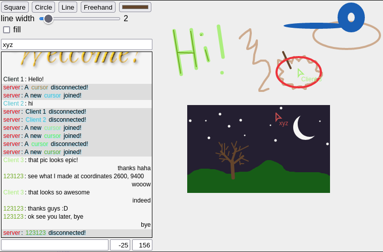

# collaborative drawing over sockets

I wanted to make a game originally, but it somehow turned into a collaborative
drawing board.

It's built using express and socket.io.

Major inspiration: https://github.com/huytd/agar.io-clone

## Run

Clone the repo and run

```
npm i
npm start
```

The server will be running at `0.0.0.0` on port `9500`


